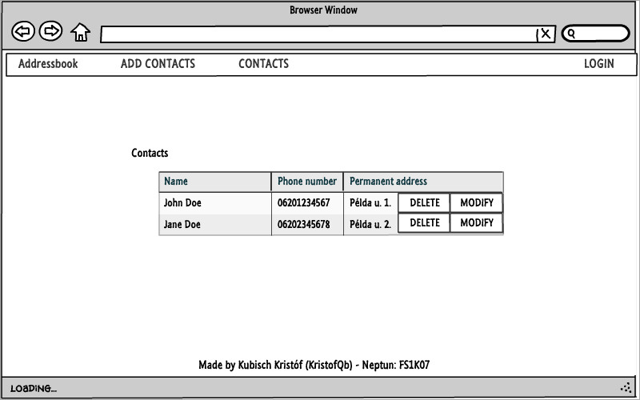

# Követelményanalízis

## Funkcionális követelmények

Megvalósítani egy tantárgyak felvételére, kezelésére szolgáló webes
technológiákkal fejlesztett alkalmazást. Elvárt követelmények aminek
tartalmaznia kell:

Egy olyan webes technológiákkal fejlesztett alkalmazás, amiben
könnyen kezelhetjük névjegyeinket. A beadandónak mininálisan tartalmaznia kell:

* legalább két modellt, egy-sok kapcsolatban
* legalább 1 űrlapot
* legalább 1 listázó oldalt
* legyen lehetőség új felvételére
* legyen lehetőség meglévő szerkesztésére
* legyen lehetőség meglévő törlésére
* legyenek benne csak hitelesítés után elérhető funkciók
* perzisztálás fájlba történjen
* közzététel Herokun

## Nem funkcionális követelmények

* Átlátható, értelmesen felépített oldal
* Könnyű olvashatóság és kezelhetőség

## Szerepkörök

* __vendég:__ a bejelentkező és regisztrációs képernyőn kívül
csak a főoldal tartalmához fér hozzá

* __felhasználó:__ a vendéghez hasonlóan eléri a főoldalt ezen felül 
hozzáadhat új névjegyet, módisíthatja és törölheti a meglévőket

## Használateseti-modell

# Tervezés

## Oldaltérkép

Publikus:

- Főoldal
- Bejelentkezés
- Regisztráció

Regisztrált felhasználó

- Főoldal
- Bejelentkezés
- Regisztráció
- Névjegyfelvétel
- Névjegy listázás
- Névjegy módosítás
- Névjegy törlése
- Kijelentkezés

## Végpontok

* GET /: főoldal
* GET /auth/login: bejelentekzési oldal
* POST /auth/login: bejelentkező adatok küldése
* GET /auth/signup: regisztrációs oldal
* POST /auth/signup: regisztrációs adatok küldése
* GET /list: névjegy listázó oldal
* GET /delete:id : névjegy törlése
* GET /modify:id : névjegy módosító oldal
* POST /modify:id : modosítot adatok küldése
* GET /add: névjegy hozzáadására szolgáló oldal
* POST /add: újonnan hozzáadott névjegy adatainak küldése
* GET /auth/logout: login oldal

## Oldalvázlatok

Főoldal

Névjegyek

## Adatmodell

## Adatbázisterv

Adattáblák szöveges leírása:

    Név: user
    Leírás: a felhasználó adatai
    Attributumok:
        - id(int): felhasználó egyedi azonosítója
        - forename(string): a felhasználó keresztneve
        - surname(string): a felhasználó vezetékneve
        - userId(string): a felhasználónév
    Kapcsolatok:
    
    Név: pbEntry
    Leírás: a névjegy adataia
    Attributumok:
        - id(egész): tágy egyedi azonosítója
        - prefix(string): a névjegyhez tartozó név előtag
        - forename(string): a névjegyhez tartozó keresztnév
        - surname(string): a névjegyhez tartozó vezetéknév
        - suffix(string): a névjegyhez tartozó név utótag
        - number(int): a névjegyhez tartozó telefonszám
        - permanentaddress(string): a névjegyhez tartozó lakcím
    Kapcsolatok: névjegy kapcsolása a felhasznalóhoz

## Állapotdiagramm

Új névjegy hozzáadása

# Felhasználói dokumentáció

## Implementáció

Az alkalmazás a Cloud9 webes fejlesztői környezetben készült

## Könyvtárstruktúra
    
    ./docs: tartlamazza a dokumentációhoz szükséges fájlokat
    ./models: adatmodelleket tartalmazza (user.js, pbEntry.js)
    ./views: a megjelenítéshez szükséges .hbs kiterjesztésü fájlok
    ./views/auth: a bejelentekzési oldalak
    ./views/partials: menü elemeinek részei
    
##Futtatás

Az alkalmazás egy 500 mb ram-mal és 1 gb tárhellyen rendelkező cloud szerveren lett megírva és tesztelve.
Futtatáshoz szükségünk van egy keretrendszerre, ami ellátja az alkalmazást a megfelelő segédkönyvtárakkal. Ilyenek a Cloud9, a Heroku.

##Telepítés

A telepítéshez le kell tölteni a megfelelő állományokat majd kicsomagolás után fel kell tölteni azokat a keretrendszerbe. A telepítést az npm install parancs kiadásával tudjuk megtenni, amit a terminálba kell beírni.
Fontos hogy a prompt a főkönyvtárban álljon.

##A program használata

A programot a node index paranccsal futtathatjuk, de ajánlott ehelyett a nodemon index parancsot használni, így nem kell mindig újraindítani a szervert ha átírunk valamit a kódban.
    
    
    
    
    
    
    

